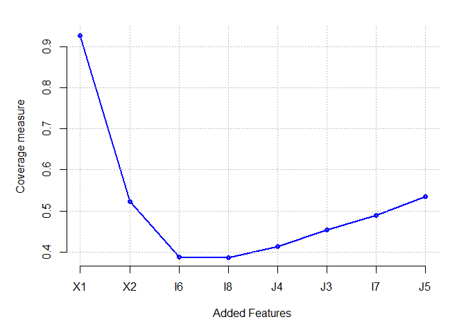
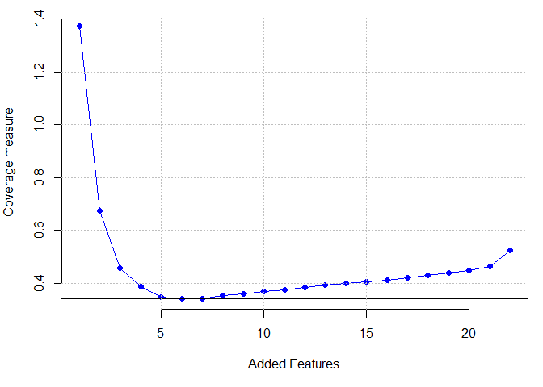
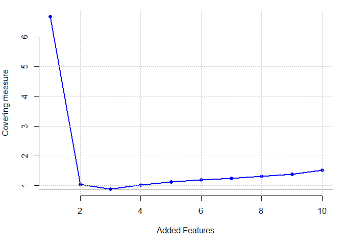
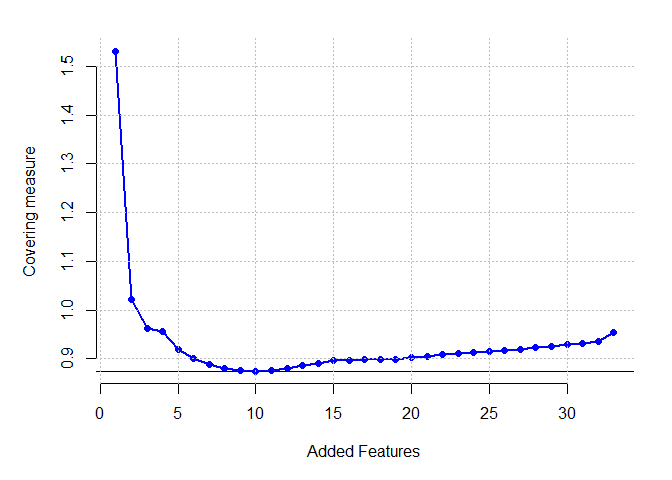

# SFtools: Space Filling Based Tools for Data Mining

SFtools is an R package available on CRAN and GitHub. It contains space
filling based tools for machine learning and data mining. Basically, the
main function proposes a new filter algorithm for the unsupervised
feature selection problems. This algorithm is based on a space filling
criterion called the coverage measure. Further updates will be added
later.

This tutorial explains the use of this library with some simulated
datasets and some real case studies. To download the library or get the
code please visit the GitHub repository:
<https://github.com/mlaib/SFtools>.

#### Version
0.1.1

#### Authors
Mohamed Laib and Mikhail Kanevski

#### Maintainer
Mohamed Laib [mohamed.laib (at) unil.ch] or [laib.med (at) gmail.com]

#### URL
[https://cran.r-project.org/package=SFtools](https://cran.r-project.org/package=SFtools)

[https://mlaib.github.io](https://mlaib.github.io)

    
#### License
GPL-3

#### Note
This work is explained in the following paper:
* Mohamed Laib and Mikhail Kanevski (2017). Unsupervised Feature Selection Based on Space
Filling Concept, https://arxiv.org/abs/1706.08894

Use it
------

    # Install it from CRAN:
    # install.packages("SFtools")

    # Or from GitHub
    #
    # devtools::install_github("mlaib/SFtools")

    library(SFtools)

Numerical experiments
---------------------

### Application to simulated dataset

#### Butterfly dataset

    library(IDmining)

    dat <- Butterfly(1000)
    dat<-dat[,-9]

    Results<- UfsCov(dat)

    ## ===========================================================================

    cou<-colnames(dat)
    nom<-cou[Results[[2]]]
    par(mfrow=c(1,1), mar=c(5,5,2,2))
    names(Results[[1]])<-cou[Results[[2]]]

    plot(Results[[1]] ,pch=16,cex=1,col="blue", axes = FALSE,
    xlab = "Added Features", ylab = "Coverage measure")
    lines(Results[[1]] ,cex=2,col="blue",lwd=2)
    grid(lwd=1.5,col="gray" )
    axis(2)
    axis(1,1:length(nom),nom)

    which.min(Results[[1]])

    ## I6 
    ##  3

### Real case studies

#### Parkinson dataset

    raw_data <- read.csv("Parkinson.csv")

    data<-raw_data[,1:22]

    data <- unique(data)
    names(data)<-c("V1","V2","V3","V4","V5","V6","V7","V8","V9","V10","V11","V12",
                   "V13","V14","V15","V16","V17","V18","V19","V20","V21","V22")

    res<-UfsCov(data)

    ## ===========================================================================

    par(mfrow=c(1,1), mar=c(5,4,1,1))
    plot(res[[1]] ,pch=16,cex=1,col="blue", xlab = "Added Features",
         ylab = "Coverage measure", axes=F)
    lines(res[[1]] ,cex=2,col="blue")
    axis(1)
    axis(2)
    abline(h=min(na.omit(res[[1]])))
    grid(lwd=1.5,col="gray" )

    which.min(res[[1]])

    ## [1] 7

#### Pageblock dataset

    raw_data <- read.table(file="PageBlocks.csv",sep=",")
    colnames(raw_data)<-c("height","lenght","area","eccen","p_black","p_and","mean_tr",
                          "blackpix","blackand","wb_trans","target")
    data<-raw_data[,1:10]
    data <- unique(data)

    res<-UfsCov(data)

    ## ===========================================================================

    par(mfrow=c(1,1), mar=c(5,4,1,1))
    plot(res[[1]] ,pch=16,cex=1,col="blue", xlab = "Added Features", ylab = "Covering measure", axes = FALSE)
    axis(1)
    axis(2)
    lines(res[[1]] ,cex=2,col="blue", lwd=2)
    abline(h=min(na.omit(res[[1]])))
    grid(lwd=1.5,col="gray" )

    which.min(res[[1]])

    ## [1] 3

#### Ionsphere dataset

    raw_data <- read.table(file="Ionosphere.csv",sep=",")
    data<-raw_data[,1:34]
    data <- unique(data)
    data<-data[,-2]

    res<-UfsCov(data)

    ## ===========================================================================

    par(mfrow=c(1,1), mar=c(5,5,2,2))
    plot(res[[1]] ,pch=16,cex=1,col="blue", xlab = "Added Features", ylab = "Covering measure", axes = FALSE)
    axis(1)
    axis(2)
    lines(res[[1]] ,cex=2,col="blue", lwd=2)
    abline(h=min(na.omit(res[[1]])))
    grid(lwd=1.5,col="gray" )

    which.min(res[[1]])

    ## [1] 10

